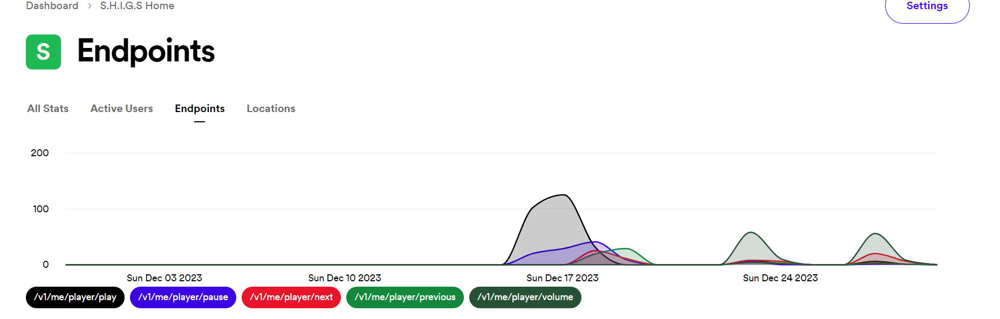
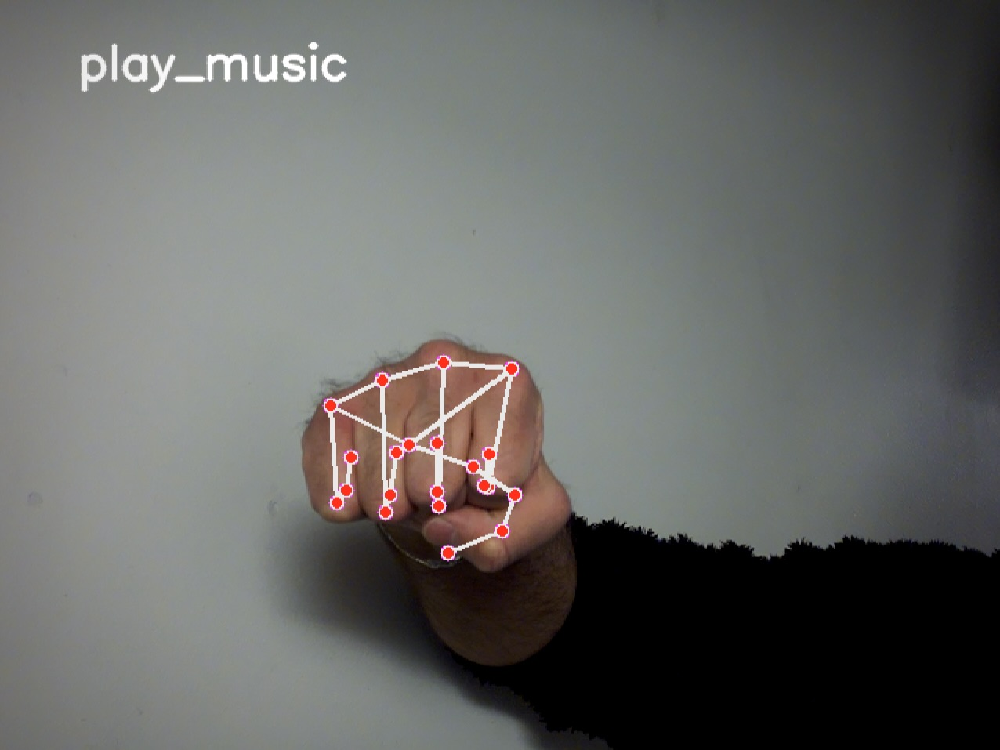
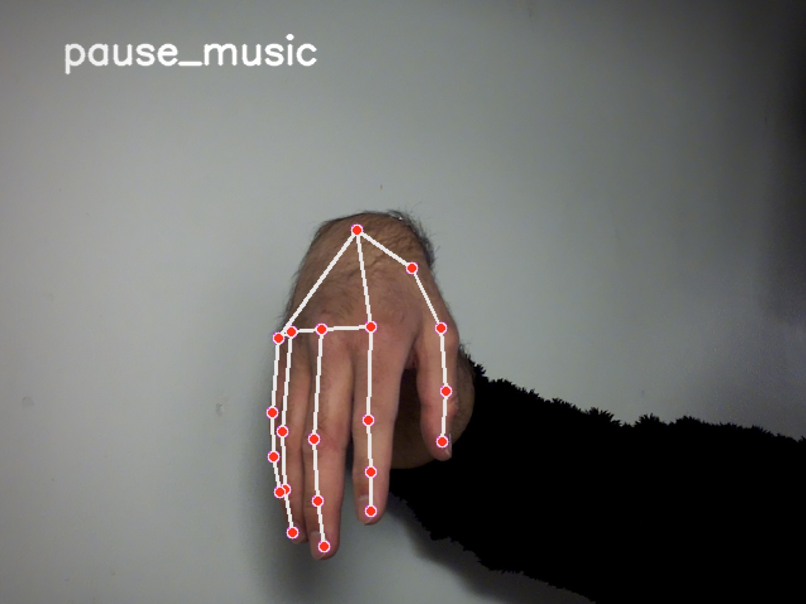
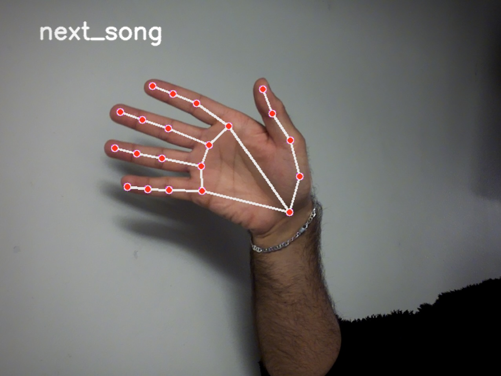
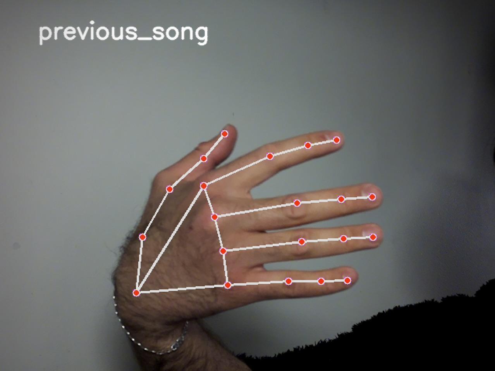
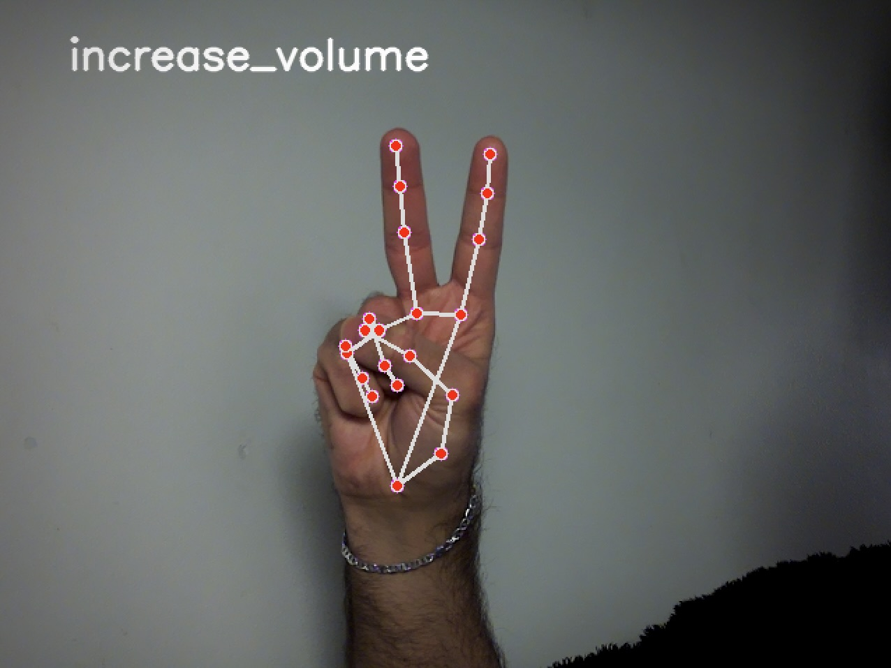
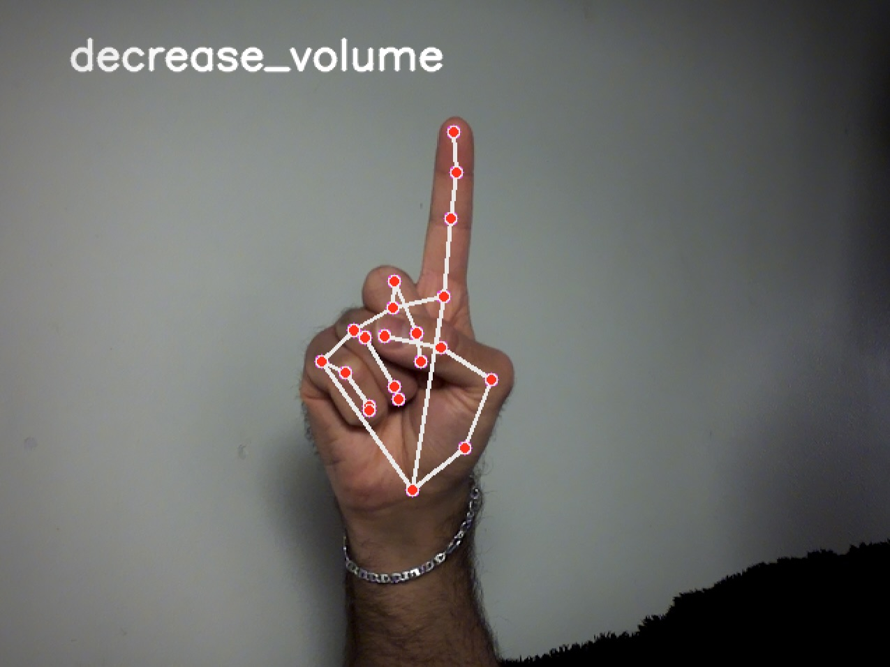

# Gesture-Controlled Spotify Player

## Table of Contents
- [Description](#description)
- [Features](#features)
- [Project File Structure](#project-file-structure)
- [Prerequisites](#prerequisites)
- [Setting Up Spotify Developer App](#setting-up-spotify-developer-app)
- [Installation](#installation)
- [Usage](#usage)
- [Mediapipe Hand Landmarks](#mediapipe-hand-landmarks)
- [Gesture Commands](#gesture-commands)

## Description
This project provides a gesture-controlled interface for Spotify, allowing users to control music playback through hand gestures. It's particularly useful in situations where hands are occupied or dirty, such as in the kitchen, or for users with speech difficulties.

Watch a demonstration of the Gesture-Controlled Spotify Player here:
[Gesture-Controlled Spotify Player Demo](https://github.com/Shallange/S.H.I.G.S/assets/53408265/247b3f22-a7fd-4e50-97ee-97aaa33197d8)

## Features
- Control Spotify playback using hand gestures.
- Recognize gestures like play, pause, next track, previous track, increase and decrease volume.
- Utilizes Flask for handling Spotify OAuth and MediaPipe for gesture recognition.

## Project File Structure


- **images**
  - [spotify_api.png](/images/spotify_api.png)
  - [hand-landmarks.png](/images/hand-landmarks.png)
  - [play_music.jpg](/images/play_music.jpg)
  - [pause_music.jpg](/images/pause_music.jpg)
  - [next_song.jpg](/images/next_song.jpg)
  - [previous_song.jpg](/images/previous_song.jpg)
  - [increase_volume.jpg](/images/increase_volume.jpg)
  - [decrease_volume.jpg](/images/decrease_volume.jpg)
- [README.md](/README.md)
- [requirements.txt](/requirements.txt)
- **src**
  - [auth_code.txt](/src/auth_code.txt)
  - [auth_server.py](/src/auth_server.py)
  - **gesture_recognition**
    - [detector.py](/src/gesture_recognition/detector.py)
    - [__init__.py](/src/gesture_recognition/__init__.py)
  - [main.py](/src/main.py)
  - [spotify_controller.py](/src/spotify_controller.py)


## Prerequisites
- Raspberry Pi 4 with Raspbian OS "Bookworm"
- Raspberry Pi Camera Module 3
- A running Spotify session
- Spotify Developer account (for API credentials)
- Internet connection
- Python 3 installed on Raspberry Pi


## Setting Up Spotify Developer App

To fully utilize the features of this Gesture-Controlled Spotify Player, you need to create an application on the Spotify Developer website. This is necessary to obtain the `Client ID` and `Client Secret` keys, essential for authenticating and interacting with the Spotify API.

### Steps to Create a Spotify Developer App:

1. Visit the [Spotify Developer Website](https://developer.spotify.com/).
2. Sign in with your Spotify account, or create one if you don't already have it.
3. Navigate to the Dashboard and create a new app.
4. Fill in the details:
   - **App Name:** Choose a name for your application.
   - **App Description:** Provide a brief description.
   - **Website:** (Optional) Your project or personal website.
   - **Redirect URI:** A URI where users can be redirected after authentication success or failure. This should match the URI in your project settings.
5. Agree to Spotify's Developer Terms of Service and Design Guidelines.
6. Once the app is created, you will receive your `Client ID` and `Client Secret`. Keep these confidential.

Remember, these credentials are essential for the authentication process in your Gesture-Controlled Spotify Player project.

- **Spotify API Usage Statistics**
  The following image displays a graph of the Spotify API usage statistics for this project. It shows the number of calls made to various endpoints (play, pause, next, previous, volume) over different dates.

  


## Installation

1. Ensure the camera is activated in the Raspberry Pi settings. (Bookworm OS typically does this automatically.)
2. Clone the repository:
    ```bash
    git clone https://github.com/Shallange/S.H.I.G.S.git
    ``` 
3. Navigate to the project directory:
    ```bash
    cd S.H.I.G.S
    ```
4. Activate the virtual environment:
    ```bash
    source .venv/bin/activate
     ```
5. Install the required dependencies:
    ```bash
    pip install -r requirements.txt
     ``` 

## Usage
1. Run the main application:
    ```bash
    python src/main.py
     ```
2. Follow the instructions in the terminal to open the provided URL for authentication. **The Flask server will handle the authentication process**.

3. Once authenticated, the camera will start, and you can use hand gestures to control Spotify playback.

## Mediapipe Hand Landmarks

- **Hand Landmarks**
  

## Gesture Commands

- **Play Music**
  

- **Pause Music**
  

- **Next Song**
  

- **Previous Song**
  

- **Increase Volume**
  

- **Decrease Volume**
  


